# Introduction

Welcome! This is the manual for the PathoStat package. PathoStat is a Shiny App 
interactive package that will let you explore metagenomic datsets, e.g.,
microbiome abundance tables, for exploratory data analysis, differential 
abundance hypothesis testing, and more. PathoStat can take metagenomic abundance
data produced by any taxonomic profiling pipeline, however, to get the most out 
of PathoStat we recommend using PathoScope2. PathoStat is not limited to 
whole-metagenomic shotgun data but also can take metataxonomic data, i.e., 16S 
rRNA, ITS, etc. Plots can be exported in vector-based file formats (svg, PDF) 
for sharing or further editing. For detailed installation instructions check the
introductory and advanced vignettes.  

```{r eval=FALSE}
require(PathoStat)
vignette("PathoStatIntro")
vignette("PathoStatUserManual")
vignette("PathoStatAdvanced")
```

# Installation and Run

While there are a few functions that can work from the console, PathoStat is 
designed to be run interactively. From the R console simply type:
```{r eval=FALSE}
source("http://bioconductor.org/biocLite.R")
biocLite("PathoStat")
```
If all went well you should now be able to load PathoStat:
```{r eval=FALSE}
require(PathoStat)
runPathoStat()
```

PathoStat functionality is grouped into eight tabs that comprise all analyses 
and visualizations. Here, we will go over each of those eight tabs and their 
main features.  

# Relative Abundance

The relative abundance tab is further subdivided into five subtabs where you can
explore your data in the form of a stacked bar chart, a heatmap, summary, and 
searchable relative abundance and count tables. You can download these data both
in read counts or in relative proportions.

## Taxonomy level

Within the Taxonomy level RA subtab, you can hove over different stacked bars 
and get the taxonomy membership and relative abundance. In addition you can sort
the stacked bars (samples) by different factors in your data and download a svg 
image for further editing.  

| 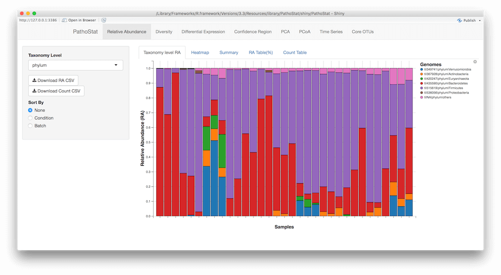

The image above shows the user interface of the stacked bar chart. On the left 
you can select the appropriate taxonomy level to plot, and by clicking on the 
gear icon on the upper right side of the chart, you can select the file format 
for your download.  

## Heatmap

This subtab shows you read count abundance of selected taxonomic levels by 
sample. As with the previous subtab, you can select what taxonomic level you 
wish to plot by simply using the dropdown menu at the left of the user 
interface.  

| 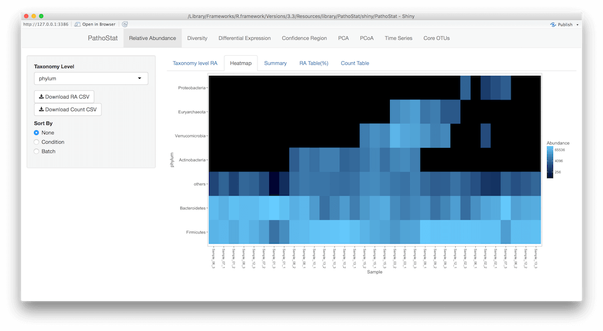

The legend on the right side of the plot shows the scale and the color gradient.

## Summary

The Summary table shows summary statistics that may come in handy for detecting 
trends in the data and identifying outliers. As with the previous subtabs, 
Summary offers redundant information that points to the distribution of the 
taxonomic composition of your samples.  

| 


## RA Table (%)

This subtab presents a searchable and sortable table of taxa abundance by 
sample. At user-selected taxonomy levels, you get information about the taxonomy
ID (taxid) of the organism as per NCBI's taxonomy database and their relative 
abundance. All columns are sortable, and at the top right corner of the table 
you can use the search case to check for specific taxa.  


| 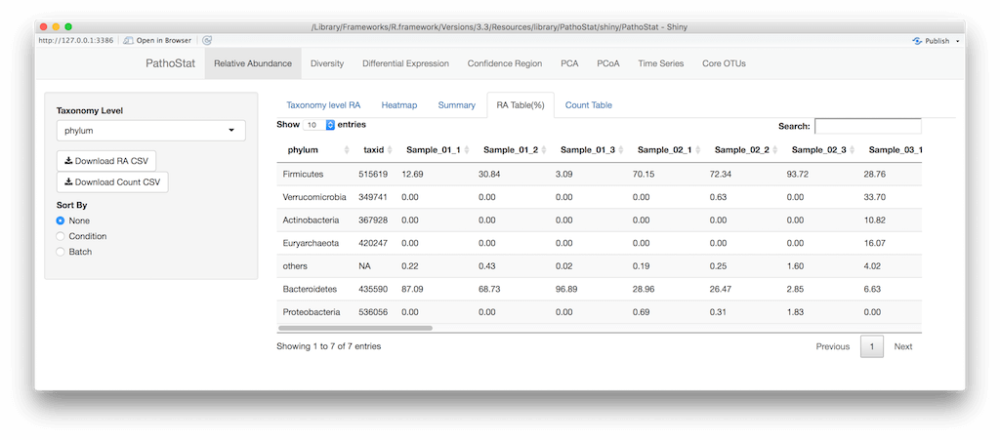

## Count table

This table is similar to the previous one but it shows abundance data as raw 
read counts instead of proportions. This is useful when you want to test for 
differential abundance of taxa between conditions. Statistical models such as 
those implemented in EdgeR and DESeq2 explicitly require count data to ensure 
specificity.  

| 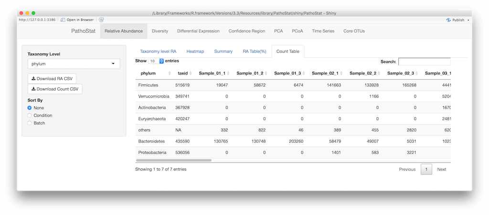

# Diversity

The second tab in PathoStat is the Diversity tab. Here, users can obtain 
estimates of alpha and beta diversity, as well as explore a clustering 
dendrogram decorated with the abundance of certain taxonomic groups by sample. 
Also, the Biplot subtab illustrates the relationships between user-selected 
variables using multidimensional scaling. Finally, the Co-Occurrence subtab 
shows the relationships among taxa at user-defined distances allowing the 
exploration of potential biological associations.  


## Alpha Diversity

Alpha diversity considers presence and absence of taxonomit units as well as 
their homogeneity or evenness. In this subtab, you obtain estimates for alpha 
diversity using the Shannon, Simpson, and Inverse Simpson metrics as a function 
of a factor.

| 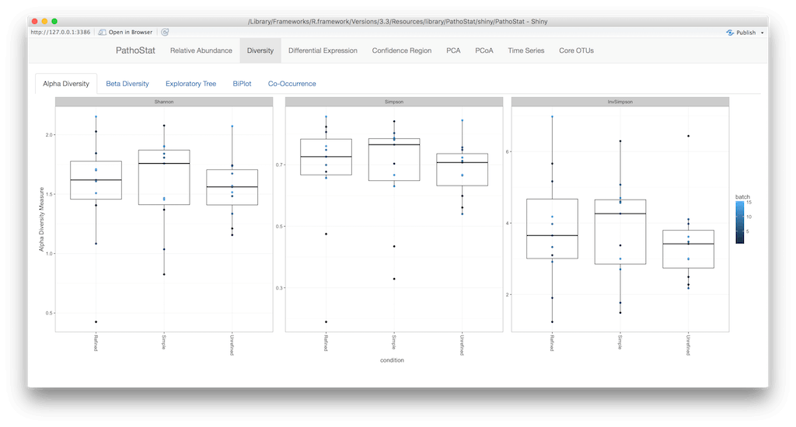

## Beta Diversity

The beta diversity subtab provides the user with a heatmap of sample to sample 
variation using the Bray-Curtis distance metric. The color key indicates a 
normalized score (the row z-score) and the dendrogram is constructed using 
hierarchical clustering.  

| 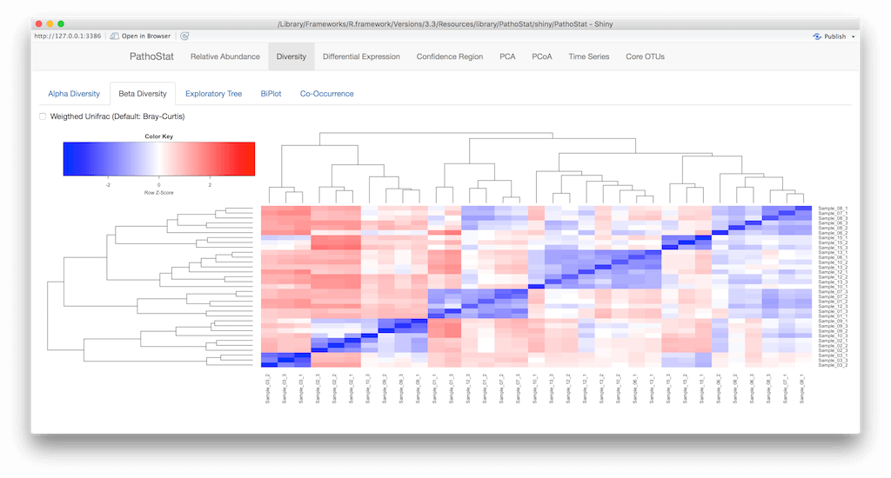

## Exploratory Tree

This subtab shows a dendrogram (tree) among all the samples in your dataset. In 
the figure below, the tree is decorated with the most abundant taxon and their 
relative abundance by condition. This tree can reveal not only similarity among 
samples but also what taxon dominates each sample.  

| 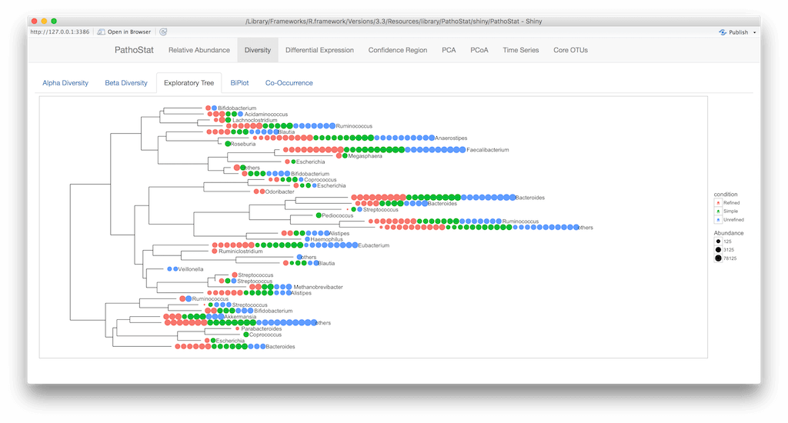

## Biplot

Another useful feature of PathoStat is the biplot. Here, the user can explore 
potential associations among taxa, and among taxa and factors in the dataset, 
e.g., condition, treatment, etc. The menu on the left side of the panel lets you
select the variables to explore as well as the method to estimate the distance 
among variables.  

| 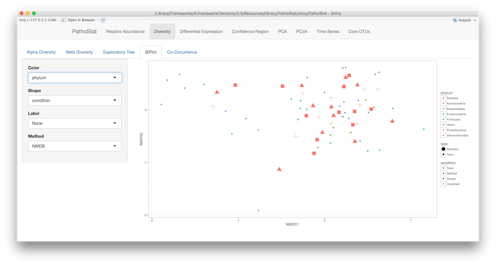

## Co-Occurrence

One recurrent question in metagenomics is whether two or more taxa tend to 
co-occur among a set of samples. In general, one might suspect that if two or
more taxa co-occur then there might be a functional relationship among them. 
In the Co-Occurrence subtab, the user selects relevant taxonomic levels to be 
compared and the maximum distance that will connect two taxa together. The 
result is a network graph where edges are proportional to the strength of 
co-occurrence.  

| 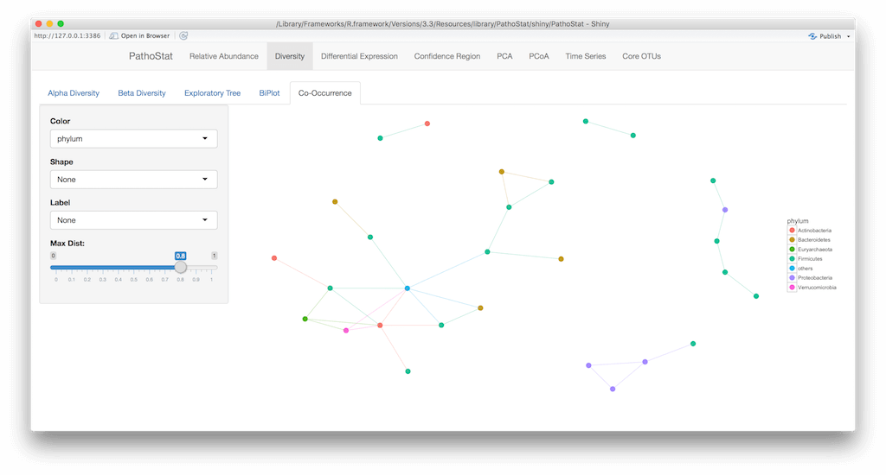

# Differential Expression

The third tab in PathoStat allows you to test for differential abundance of taxa
between conditions. This test is analogous to differential expression of genes 
in transcriptomic experiments and uses similar statistical models.

## Expression Plots

In the Expression Plot subtab, you first select the taxonomy level of choice for
the comparison and then you select the primary and secondary covariates. The 
results are shown as BoxPlots colored by covariate.  

| 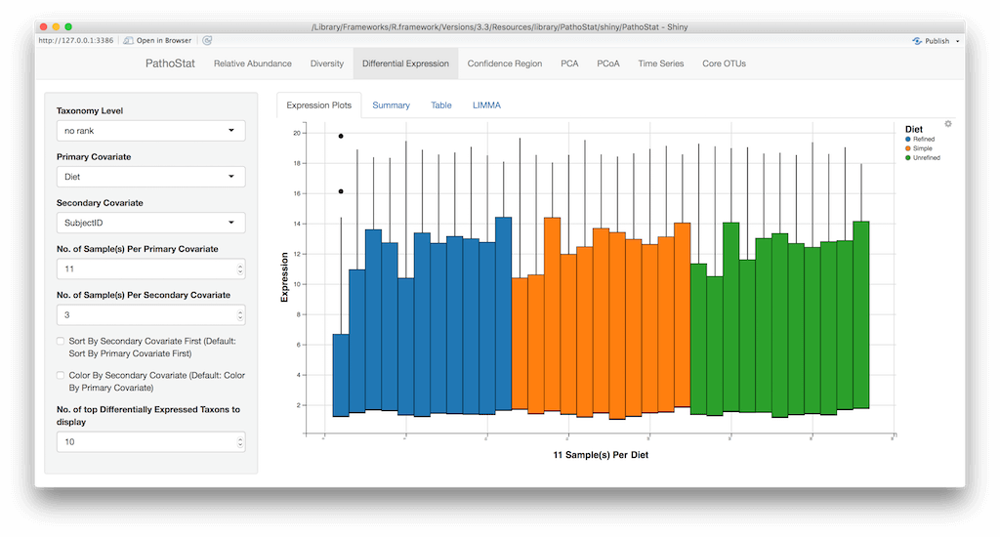

## Summary, Table and LIMMA

The Summary subtab shows text summary of the data used for the BoxPlots in the 
Expression Plots subtab. The next two subtabs summarize the results as a table 
of raw values and as a Fold Change table, respectively.  

| 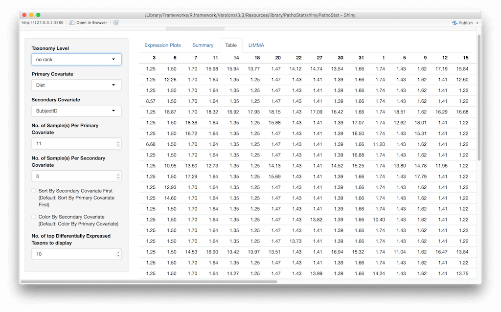

| 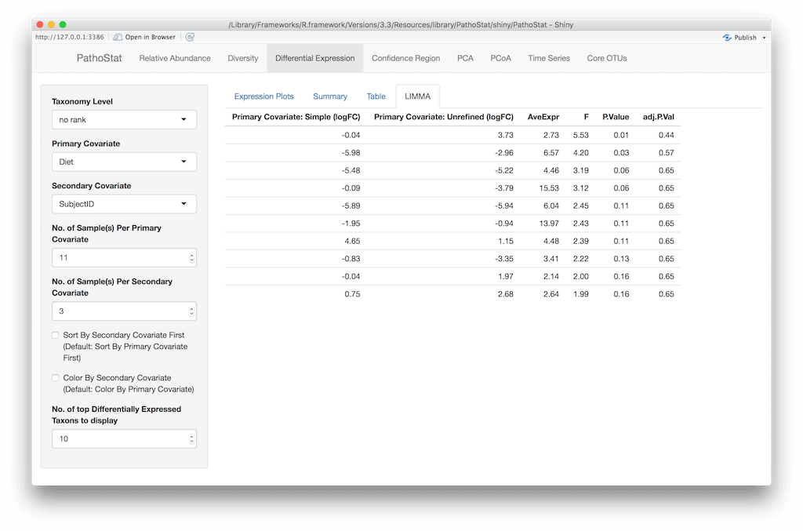

# Confidence Region

Many times researchers are interested in the accuracy of taxon abundance 
estimates. In this subtab, we provide a way to compare within-sample taxa in 
terms of their abundance estimate and 95% confidence interval.  

| 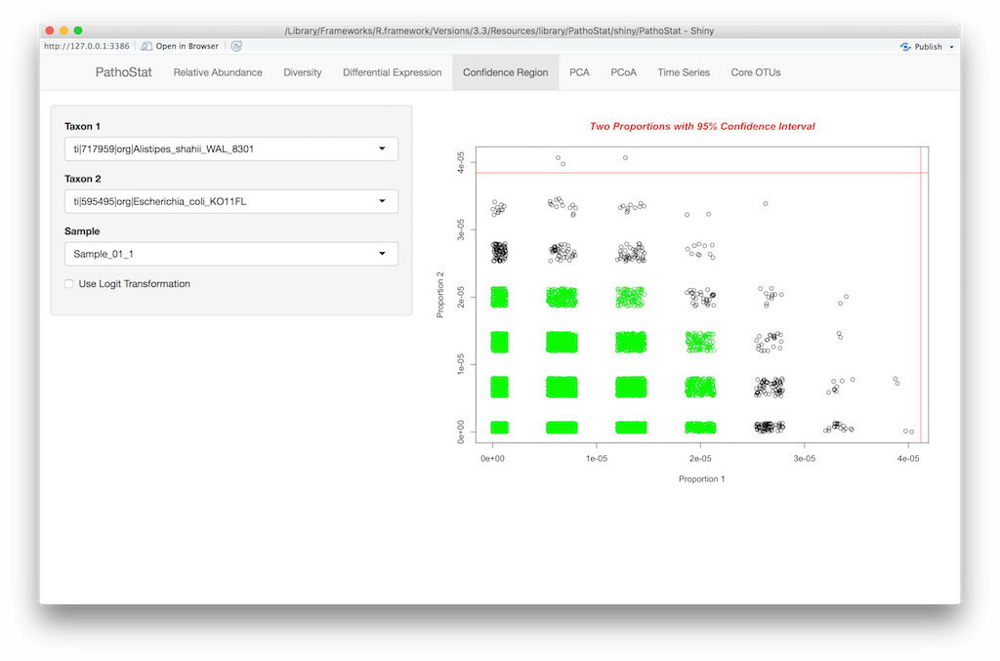

On the left-side menu, you can select both the sample and the taxa to be used in
the comparison. The results are plotted as a jitter plot that indicates the 95% 
confidence interval between the selected taxa.  

#PCA and PCoA

The next two tabs in PathoStat calculate multidimensional scaling using 
Principal Components and Principal Coordinates Analysis. These tools can help 
you odentify overall trends in the data. For instance, you can explore whether 
your samples are related by some biological condition of interest or by 
technical batch, in which case you would need to denoise the data first using 
methods such as surrogate variable analysis.

| 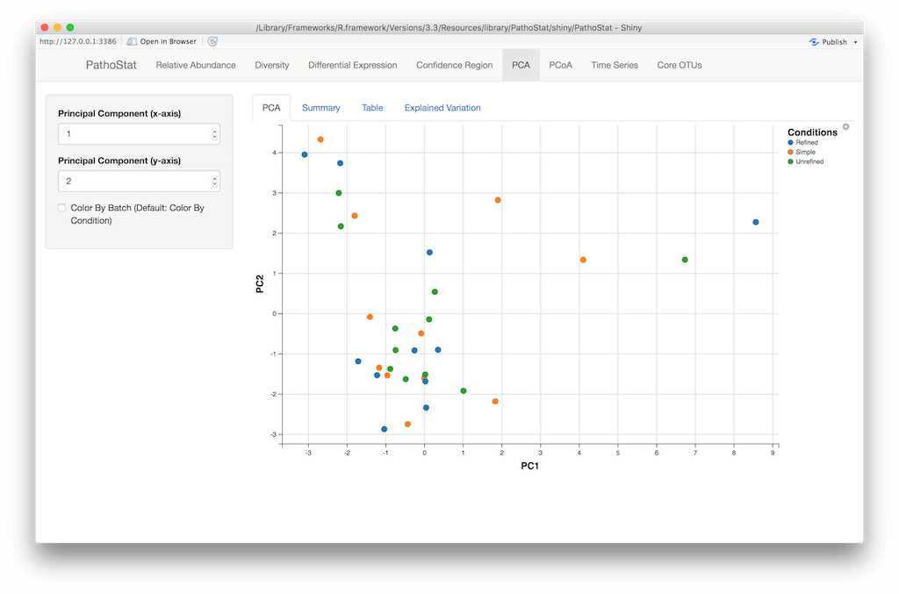

## Explained Variation

An important aspect of PCA analysis is to understand to what extend the 
resulting vectors can explain the observed multidimensional variation. In this 
subtab, you can get an idea of that by exploring the different columns in terms 
of Proportion of Variance, Cumulative Variance and percent variation, among 
others.  

| 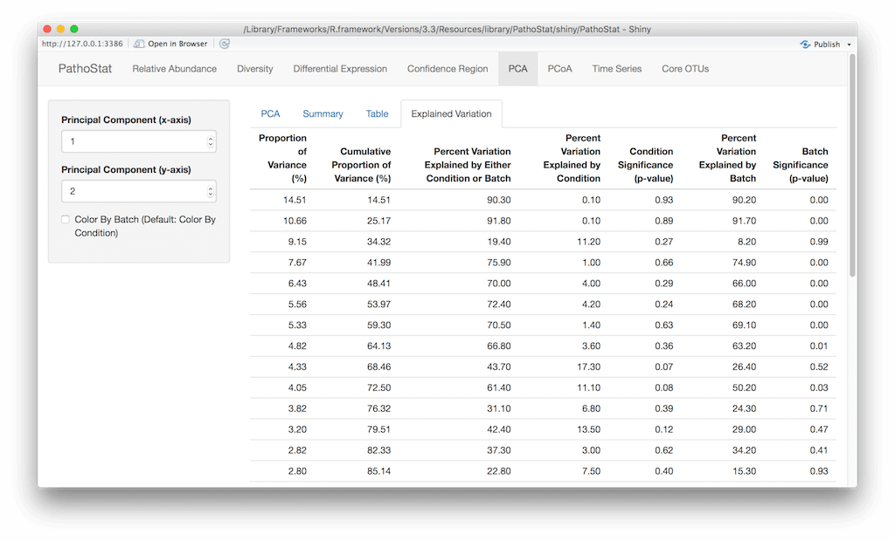

#Time Series

The Time Series tab allows you to understand variation in relative abundance as 
a function of time. Strictly speaking, you could use any discrete numerical 
variable from your dataset for visualization. In the example below, we use 
SubjectID (not a numerical variable though) and agglomerate the data by Phylum.

| 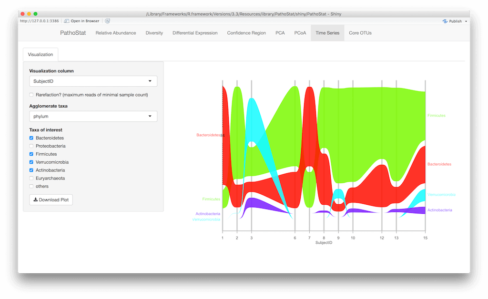

#Core OTUs

Many times we would like to understand what is particular and what is general 
about a set of metagenomic samples. Analogous to pangenome analysis in 
comparative genomics, the Core OTU tab allows you to identify shared taxa or 
core taxa among samples.  

| 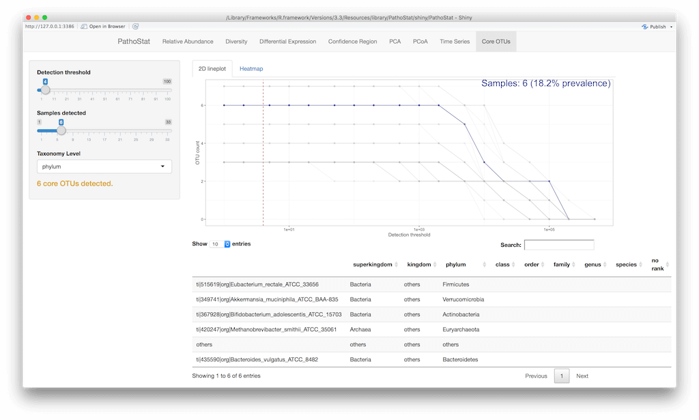

You first set up a detection threshold, meaning a minimum abundance proportion a
OTU must have in order to be considered in the analysis, and the number of 
samples selected from your dataset. You can also select the taxonomic level of 
interest at which you would like to perform the analysis.  


